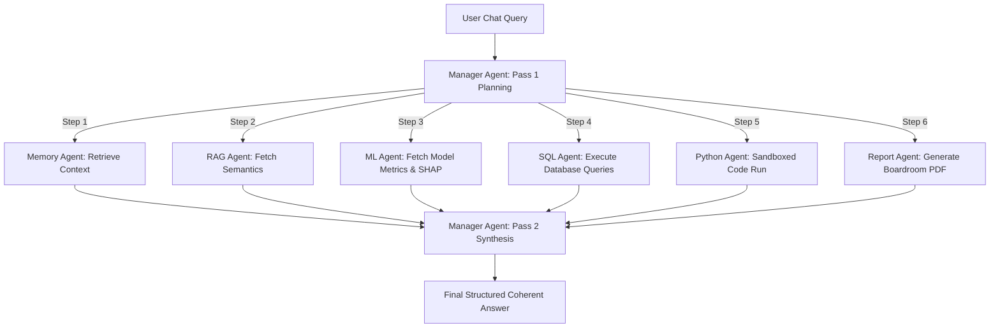

# 🌌 Nexora AI — Version 1.0 Production Platform

<p align="center">
  
</p>

<h3 align="center">Nexora AI — Full-Stack AI Orchestration, RAG, & Machine Learning Workspace</h3>

<p align="center">
  <a href="https://opensource.org/licenses/MIT"></a>
  <a href="https://www.python.org/"></a>
  <a href="https://nodejs.org/"></a>
  <a href="https://nextjs.org/"></a>
</p>

---

Welcome to **Nexora AI v1.0**. This document serves as the master technical blueprint and developer guide for the entire workspace. Nexora AI is a comprehensive dashboard enabling teams to build semantic knowledge bases, run sandboxed data analysis scripts, query corporate databases through AI, and train custom Machine Learning models with built-in interpretability.

---

## 📐 Platform Architecture & Flow

The entire platform is organized as a multi-tier decoupled system connected via REST APIs and real-time streaming sockets.

```mermaid
sequenceDiagram
    autonumber
    actor User as User Browser (Next.js)
    participant Nginx as Nginx Reverse Proxy
    participant Backend as FastAPI Server
    participant DB as PostgreSQL / SQLite
    participant Qdrant as Qdrant Vector Engine
    participant Sandbox as Python Execution Engine
    participant LLM as External APIs (Gemini/OpenAI)

    User->>Nginx: Request Route (/api/v1/chat)
    Nginx->>Backend: Forward Request
    Backend->>DB: Fetch Active Session & Workspace
    DB-->>Backend: Session Metadata
    Backend->>LLM: Stream Prompt (Planner Agent)
    LLM-->>Backend: Token Stream (Planning Steps)
    rect rgb(30, 41, 59)
        note right of Backend: If SQL / Python task detected
        Backend->>Sandbox: Execute code or query database
        Sandbox-->>Backend: Execution Logs & Result Sets
    end
    Backend->>Qdrant: Query semantic chunks (RAG)
    Qdrant-->>Backend: Matching document context
    Backend->>User: Stream final response tokens + Sources
```



---

## 🧠 Core Backend Engines (Deep Dive)

### 1. Tabular ML Studio Engine (`ml_service.py`)
Built on top of Scikit-Learn, this module provides an automated tabular machine learning workspace:
- **Feature & Target Scanning (`get_features_and_targets`)**: Scans tabular datasets (CSV/XLSX), recommends target columns matching concepts (e.g. `price`, `revenue`, `churn`, `target`), and profiles numerical vs. categorical columns.
- **ColumnTransformer Preprocessing**: 
  - *Numerical columns*: Handled by a pipeline containing median-strategy `SimpleImputer` and `StandardScaler`.
  - *Categorical columns*: Handled by a pipeline containing most-frequent `SimpleImputer` and `OneHotEncoder` (ignoring unknown classes).
- **Task & Model Selection**: Cardinality heuristics determine the task type:
  - *Classification* (non-numeric target or cardinality $\le 10$): Random Forest Classifier, Gradient Boosting Classifier, or Logistic Regression.
  - *Regression* (continuous numeric target): Random Forest Regressor, Gradient Boosting Regressor, or Linear Regression.
- **SHAP Interpretability (`get_shap_explanation`)**: Explains model decisions using **SHAP (SHapley Additive exPlanations)** values, returning feature rankings by mean absolute SHAP attributions.
- **Model Registry (`get_model_comparison`)**: Registers runs under `storage/ml_registry/comparison_{doc_id}.json` to track and rank multiple algorithms side-by-side.

### 2. Fast LLM Fine-Tuning & Quantization
For large language model training, the system integrates a PEFT QLoRA pipeline:
- **Unsloth Training Engine (`unsloth_integration_service.py`)**: Uses Unsloth's `FastLanguageModel` to load models in 4-bit precision, configuring LoRA ranks (rank $r=16$, alpha $\alpha=32$) on target modules (`q_proj`, `k_proj`, etc.). Logs metrics (Loss, Learning Rate, tokens/sec, GPU VRAM) and outputs model adapters. Contains a fallback simulator for CPU development environments.
- **LoRA Weight Fusion (`lora_merge_service.py`)**: Integrates PEFT's `merge_and_unload()` routines to combine trained Adapter weights back into base model parameters.
- **llama.cpp Quantization Export (`gguf_export_service.py`)**: Quantizes PyTorch models into GGUF formats (e.g. `Q4_K_M`) and writes custom **Ollama Modelfile manifests** using ChatML tokenizer markers (`<|im_start|>`, `<|im_end|>`).
- **Hugging Face Hub Publisher (`huggingface_service.py`)**: Authenticates using the developer's `HF_TOKEN` via `HfApi`, auto-creates repositories, and uploads adapter weights directly to `https://huggingface.co/{repo_id}`.
- **Model Local Runner (`nexora_provider.py`)**: Loads local models dynamically from the Hugging Face cache folder (`HF_HUB_CACHE`) using PEFT, supporting GPU CUDA acceleration and CPU fallbacks.

### 3. Adaptive RAG & Search Pipeline
RAG operations are dynamically managed using classification and intent-based routing:
- **Adaptive Retrieval Engine (`adaptive_retrieval_service.py`)**: Queries are first classified into categories (Greeting, Summarization, Coding, Debugging). Retrieval parameters are adjusted accordingly:
  - Dynamic Top-K is set (e.g. up to 12 context blocks for Coding/Debugging; only 2 for greetings).
  - Near-duplicate matches are removed by computing text-similarity Jaccard indices.
- **Parallel Hybrid Search (`hybrid_search_service.py`)**: Parallelizes Lexical search (SQLite FTS/PostgreSQL Full-Text indexes) and Semantic search (Qdrant vector indexes using the **`sentence-transformers/all-MiniLM-L6-v2`** 384-dimensional embedding model). Combines hits using Reciprocal Rank Fusion ($70\%$ vector, $30\%$ lexical).
- **RAG Evaluation (`rag_evaluation_service.py`)**: Measures RAG quality using LLM-as-a-judge metrics: *Context Precision*, *Context Recall*, *Groundedness*, and *Faithfulness*.
- **Semantic Knowledge Graphs (`knowledge_graph_service.py`)**: Extracts entities from text based on type rules (Languages: *python, rust*, etc.; Frameworks: *fastapi, nextjs*, etc.; Databases: *postgresql, redis*, etc.). Links concepts that appear together in a document using `KnowledgeNode` and `KnowledgeEdge` relations.

### 4. Enterprise Security & Workspace Restoration
- **PII Masking (`pii_masking_service.py`)**: Scans user prompts using regex compile rules to strip emails, phone numbers, credit card numbers, Indian Aadhar numbers, and API keys, replacing them with tokens (e.g., `[[MASKED_EMAIL]]`) before external LLM dispatch.
- **Workspace Permission Control (`permission_service.py`)**: Enforces Role-Based Access Control (RBAC) across workspaces. Roles supported: `OWNER`, `ADMIN`, `MEMBER`, and `VIEWER`.
- **JSON & ZIP Workspace Backups (`workspace_export_service.py`, `workspace_import_service.py`)**: Packages workspace folders, conversations, messages, reactions, comments, templates, and members into structured JSON archives. Imports backups back into active tables while managing full transactional database rollbacks on failure.

---

## ⚙️ Multi-Agent Orchestration (Agent Deep Dive)

The chat screen utilizes an intelligent **Multi-Agent Orchestration Loop** managed by the `AgentOrchestrator` and orchestrated by a two-pass `ManagerAgent`.



### Detailed Agent Operational Specs:

#### 1. Manager Agent (`manager_agent.py`)
- **Pass 1: Planning**: Evaluates the user request against the capabilities of all registered agents using LLM tool calling. It builds an ordered list of execution steps (dependency-aware).
- **Pass 2: Synthesis**: Collects text summaries and data structures returned by the workers. It compiles a unified, cited, and boardroom-ready final response while guaranteeing anti-hallucination policies (no raw numbers can be fabricated outside the inputs).

#### 2. ML Agent (`ml_agent.py`)
- Wrapping the `MLService`, it queries the model registry and SHAP cache for the dataset linked to the conversation.
- If requested to run a prediction, it collects the inputs, invokes the joblib pipeline, and explains the feature importances to the user.

#### 3. RAG Agent (`rag_agent.py`) & Hugging Face Embedding
- Connects to the **Qdrant Vector Database**.
- Automatically indexes uploaded files into semantic fragments using the **`sentence-transformers/all-MiniLM-L6-v2`** model fetched from Hugging Face Hub, converting text blocks into 384-dimensional vector spaces.
- Retrieves semantic text overlaps based on cosine similarity, ensuring that custom files, policy guidelines, and documents are incorporated in the generation process.

#### 4. SQL Agent (`sql_agent.py`)
- Connects to relational databases.
- Inspects table schemas, generates optimized queries, executes them, and returns formatted result tables.

#### 5. Python Agent (`python_agent.py`)
- Generates Python code to perform statistical tests or generate complex graphs.
- Executes scripts securely inside a sandboxed sub-process, saving outputs in the local scratch directory.

#### 6. Email Agent (`email_agent.py`)
- **MIME Generation**: Composes complex multipart MIME messages (`MIMEMultipart`) containing text or HTML sections.
- **Regex Extraction**: Parses the planner agent's instructions (e.g. `to: client@co.com`, `subject: report`) using regular expressions.
- **Dynamic Attachments**: Automatically looks up prior agent results (such as PDF files generated by `report_agent`) and appends them to the email envelope using `MIMEApplication`.
- **SMTP Gateway Routing**: Dispatches messages using SMTP server authentication (`SMTP_HOST`, `SMTP_PORT`, `SMTP_USER`, `SMTP_PASSWORD`) with a robust mock log fallback for local developers.

#### 7. Calendar Agent (`calendar_agent.py`)
- **Event Scheduling**: Checks for meeting slots and records events inside the `calendar_events` table using SQLAlchemy.
- **Conflict Checker**: Queries the relational database to verify that overlapping sessions do not exist in the requested timeline.
- **iCalendar Compliant Exports**: Generates standard, RFC-5545 compliant `.ics` calendars saved in the user's workspace reports directory, enabling seamless import into Outlook, Google Calendar, or Apple Calendar.

#### 8. Memory Agent (`memory_agent.py`)
- Queries past conversation context and user configuration profiles to maintain consistency across messages.

#### 9. Analytics Agent (`analytics_agent.py`)
- Computes statistical summaries of raw datasets (column mean, missing value frequencies, variance, class distributions).

#### 10. Report Agent (`report_agent.py`)
- Gathers data and generates comprehensive, high-quality, boardroom-ready PDF or HTML reports.

---

## 💾 Relational Database Design

The database contains 24 normalization tables mapped in SQLAlchemy models under `app/models/`:

- **User Accounts (`user.py`)**: `users` stores profile information, email addresses, and passwords hashed using bcrypt.
- **Workspace Structures**:
  - `workspaces` (`workspace.py`): Tracks workspaces, ownership, and enterprise feature restrictions.
  - `workspace_members` (`workspace_member.py`): Maps collaborators to workspaces with roles (`OWNER`, `ADMIN`, `MEMBER`, `VIEWER`).
  - `workspace_invitations` (`workspace_invitation.py`): Manages tokenized invitations for new collaborators.
  - `workspace_templates` (`workspace_template.py`): Configuration templates for starting workspaces.
- **Chat Feed**:
  - `conversations` (`conversation.py`): Chat streams grouped by folders.
  - `messages` (`message.py`): Interactive message objects.
  - `message_reactions` (`message_reaction.py`): Emoji reactions linked to messages.
  - `conversation_comments` (`conversation_comment.py`): Review threads allowing user tagging and mentions (`mention.py`).
  - `conversation_versions` (`conversation_version.py`): Version history of conversation trees.
- **Knowledge Base & RAG**:
  - `knowledge_bases` (`knowledge_base.py`): Relational catalog of workspace knowledge.
  - `knowledge_documents` (`knowledge_document.py`): Physical paths of uploaded datasets.
  - `document_chunks` (`document_chunk.py`): Text mappings to vector IDs.
  - `retrieval_logs` (`retrieval_log.py`): Logs query latencies, vector hit counts, and LLM precision scores.
  - `knowledge_nodes` & `knowledge_edges` (`knowledge_graph.py`): Concepts and concept relations.
- **Training Studio (`training_project.py`)**:
  - `training_projects`: Datasets linked for fine-tuning.
  - `training_runs`: Active training checkpoints and targets.
  - `training_logs`: Step-by-step step losses and learning rates.
  - `training_artifacts`: Paths of adapter binaries.
- **Calendar events (`calendar_event.py`)**: `calendar_events` stores booked meeting rooms, start/end datetimes, and attendees.

---

## 🎨 Frontend Component Map

The dashboard frontend contains 15 modular React components written in TypeScript:

| Component | File | Responsibility |
| :--- | :--- | :--- |
| **Agent Studio** | `agent-studio.tsx` | UI to configure developer system prompts and LLM parameters. |
| **Data Analytics** | `analytics-area.tsx` | Grid layout profiling dataset stats, columns, and correlations. |
| **Calendar Scheduler**| `calendar-studio.tsx` | Calendar layout representing meeting rooms and sync `.ics` buttons. |
| **Email Interface** | `email-studio.tsx` | Sandbox representing SMTP logs and MIME dispatch forms. |
| **Evaluation Board** | `eval-dashboard.tsx` | Visual charts of RAG faithfulness and groundedness scores. |
| **Knowledge Graph** | `knowledge-area.tsx` | Document vector lists and interactive D3 semantic networks. |
| **ML Studio** | `ml-area.tsx` | Starts tabular model trainings and displays SHAP attribution graphs. |
| **Code Sandbox** | `python-studio.tsx` | Editor panel executing secure Python scripts in backend runners. |
| **Report Generator** | `report-area.tsx` | Renders boardroom PDF export previews. |
| **SQL Terminal** | `sql-studio.tsx` | Database browser executing SELECT queries. |
| **Chat Hub** | `chat-area.tsx` | SSE stream interface tracking multi-agent decisions. |

---

## 🛠️ Complete Local Development Guide

### 1. Backend Service Setup
Navigate to the backend directory and set up a Python virtual environment:
```bash
cd apps/backend

# Create a virtual environment
python -m venv venv

# Activate virtual environment
# On Linux/macOS:
source venv/bin/activate
# On Windows:
venv\Scripts\activate

# Install dependencies
pip install -r requirements.txt

# Run database setup & migrations (creates local dev SQLite database)
python -c "from app.db.database import init_db; init_db()"

# Start the uvicorn API server
uvicorn app.main:app --reload --port 8000
```
The API Swagger documentation will be available at `http://localhost:8000/docs`.

### 2. Frontend Web Interface Setup
Open a new terminal window, navigate to the frontend folder, and install the Node packages:
```bash
cd apps/frontend

# Install dependencies
npm install

# Run Next.js hot-reloaded development server
npm run dev
```
Open `http://localhost:3000` to view the local application dashboard.

---

## 🐳 Docker Staging Deployment

For production-simulated environments, we use Docker Compose to run the entire service mesh.

1. **Configure API Secrets**:
   Copy `.env.production.example` to `.env.production` at the root of the project:
   ```bash
   cp .env.production.example .env.production
   ```
   Open the file and configure your LLM provider secret tokens:
   - `GEMINI_API_KEY`: Google Gemini API key.
   - `OPENAI_API_KEY`: OpenAI API token.

2. **Start the Container Stack**:
   Use the Makefile commands to build images and launch containers:
   ```bash
   make up
   ```
   This orchestrates:
   - **Nginx Proxy**: Enforces routing (`/api` routes to FastAPI, other routes to Next.js).
   - **FastAPI backend (App)**: Web server.
   - **Next.js frontend (App)**: Static SSR server.
   - **PostgreSQL**: Production relational database storage.
   - **Qdrant**: High-performance vector database.
   - **Redis**: Fast cache storage for agent states and rate limits.

3. **Verify Health & Logs**:
   ```bash
   make status
   make logs
   ```
