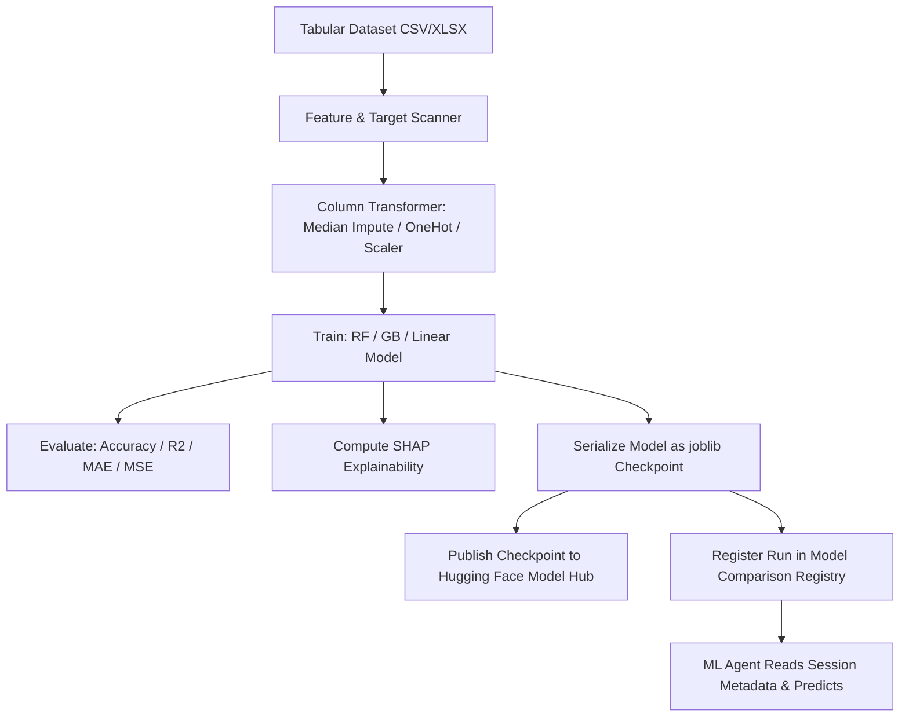
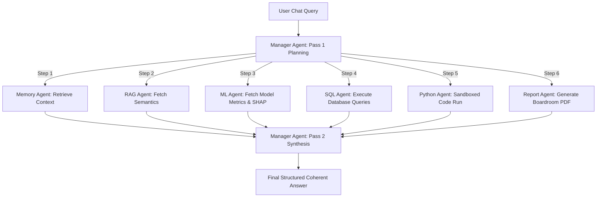
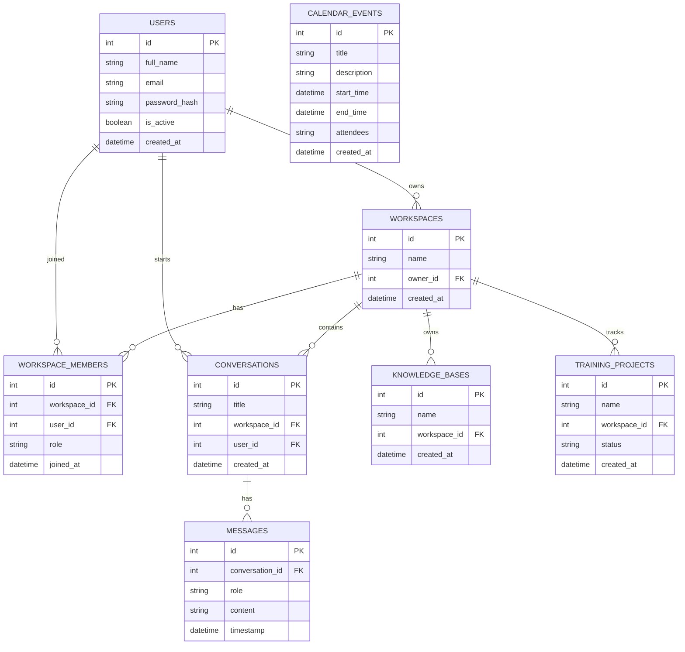

# 🌌 Nexora AI — Version 1.0 Production Platform

<p align="center">
  
</p>

<h3 align="center">Nexora AI — Full-Stack AI Orchestration, RAG, & Machine Learning Workspace</h3>

<p align="center">
  <a href="https://opensource.org/licenses/MIT"></a>
  <a href="https://www.python.org/"></a>
  <a href="https://nodejs.org/"></a>
  <a href="https://nextjs.org/"></a>
</p>

---

Welcome to **Nexora AI v1.0**. This document serves as the master technical blueprint and developer guide for the entire workspace. Nexora AI is a comprehensive dashboard enabling teams to build semantic knowledge bases, run sandboxed data analysis scripts, query corporate databases through AI, and train custom Machine Learning models with built-in interpretability.

---

## 📐 Platform Architecture & Flow

The entire platform is organized as a multi-tier decoupled system connected via REST APIs and real-time streaming sockets.

```mermaid
sequenceDiagram
    autonumber
    actor User as User Browser (Next.js)
    participant Nginx as Nginx Reverse Proxy
    participant Backend as FastAPI Server
    participant DB as PostgreSQL / SQLite
    participant Qdrant as Qdrant Vector Engine
    participant Sandbox as Python Execution Engine
    participant LLM as External APIs (Gemini/OpenAI)

    User->>Nginx: Request Route (/api/v1/chat)
    Nginx->>Backend: Forward Request
    Backend->>DB: Fetch Active Session & Workspace
    DB-->>Backend: Session Metadata
    Backend->>LLM: Stream Prompt (Planner Agent)
    LLM-->>Backend: Token Stream (Planning Steps)
    rect rgb(30, 41, 59)
        note right of Backend: If SQL / Python task detected
        Backend->>Sandbox: Execute code or query database
        Sandbox-->>Backend: Execution Logs & Result Sets
    end
    Backend->>Qdrant: Query semantic chunks (RAG)
    Qdrant-->>Backend: Matching document context
    Backend->>User: Stream final response tokens + Sources
```



---

## 🧠 Custom ML Model Lifecycle & Hugging Face Integration

Nexora AI includes a complete **Machine Learning Studio** (`ml_service.py`) and Hugging Face publisher API built directly into the backend. Instead of relying solely on general LLMs, users can train, evaluate, publish, and run inference locally or in the cloud.



### 1. Ingestion & Preprocessing Pipeline
- **Auto-Detection (`get_features_and_targets`)**: When a user selects a dataset document, the system scans all columns. It recommends target variables based on column names (e.g., matching keywords like *price, churn, target*) and detects types (numeric vs. categorical).
- **Dynamic Preprocessing**:
  - **Numerical columns**: Imputed using `SimpleImputer` (median strategy) and scaled using `StandardScaler`.
  - **Categorical columns**: Imputed using `SimpleImputer` (most frequent strategy) and encoded using `OneHotEncoder` (handling unknown categories gracefully).
  - All operations are bound inside a Scikit-Learn `ColumnTransformer`.

### 2. Automated Task Selection & Model Training (`train_pipeline`)
The engine dynamically chooses the modeling task type based on target cardinality:
- **Classification**: Triggered if the target is non-numeric or has $\le 10$ unique classes. Algorithms supported: *Random Forest Classifier, Gradient Boosting Classifier, Logistic Regression*.
- **Regression**: Triggered for continuous numerical targets. Algorithms supported: *Random Forest Regressor, Gradient Boosting Regressor, Linear Regression*.

The data is split ($80\%$ training, $20\%$ test), the model is fitted, and primary metrics are calculated:
- **Classification metrics**: Accuracy, Precision, Recall, F1-Score.
- **Regression metrics**: $R^2$, Mean Absolute Error (MAE), Mean Squared Error (MSE).

### 3. Serialization & Model Registry
- **joblib Checkpoints**: Once trained, the entire pipeline (preprocessor + model estimator) is serialized and cached at `storage/ml_models/model_{doc_id}.joblib` for instant live predictions.
- **Model Registry**: Training metrics and parameters are registered at `storage/ml_registry/comparison_{doc_id}.json` to compare different algorithms side-by-side.

### 4. SHAP Feature Interpretability
After training, the platform calculates **SHAP (SHapley Additive exPlanations)** values.
- SHAP attribution ranks features by their mean absolute contribution ($|SHAP|$) to the target prediction.
- This allows users (and AI agents) to understand *why* the model makes specific predictions (e.g. "Tenure contributes $35\%$ to churn risk").

### 5. Hugging Face Hub Integration
- **Hugging Face Model Publisher (`/publish/huggingface`)**: Developers can upload trained model weights and adapter checkpoints directly to the Hugging Face Hub using the `HuggingFaceService`. It validates the user's `HF_TOKEN`, creates a model repository on the hub, and pushes files to `https://huggingface.co/{repo_id}`.
- **Inference Provider (`huggingface_provider.py`)**: Connects to the Hugging Face Serverless API router (`https://router.huggingface.co/v1`) using the model defined in `NEXORA_MODEL_ID` to run large chat models in the cloud without local hardware constraints.
- **Local Model Runner (`nexora_provider.py`)**: For local inference, it loads the fine-tuned Nexora model (`vishvam26/nexora-qwen3.5-4b-lora-v1` built on the `Qwen/Qwen2.5-1.5B-Instruct` base model) with GPU CUDA acceleration and automatic CPU fallback. It uses `huggingface_hub.constants.HF_HUB_CACHE` to load and check for adapter files.

---

## ⚙️ Multi-Agent Orchestration (Agent Deep Dive)

The chat screen utilizes an intelligent **Multi-Agent Orchestration Loop** managed by the `AgentOrchestrator` and orchestrated by a two-pass `ManagerAgent`.



### Detailed Agent Operational Specs:

#### 1. Manager Agent (`manager_agent.py`)
- **Pass 1: Planning**: Evaluates the user request against the capabilities of all registered agents using LLM tool calling. It builds an ordered list of execution steps (dependency-aware).
- **Pass 2: Synthesis**: Collects text summaries and data structures returned by the workers. It compiles a unified, cited, and boardroom-ready final response while guaranteeing anti-hallucination policies (no raw numbers can be fabricated outside the inputs).

#### 2. ML Agent (`ml_agent.py`)
- Wrapping the `MLService`, it queries the model registry and SHAP cache for the dataset linked to the conversation.
- If requested to run a prediction, it collects the inputs, invokes the joblib pipeline, and explains the feature importances to the user.

#### 3. RAG Agent (`rag_agent.py`) & Hugging Face Embedding
- Connects to the **Qdrant Vector Database**.
- Automatically indexes uploaded files into semantic fragments using the **`sentence-transformers/all-MiniLM-L6-v2`** model fetched from Hugging Face Hub, converting text blocks into 384-dimensional vector spaces.
- Retrieves semantic text overlaps based on cosine similarity, ensuring that custom files, policy guidelines, and documents are incorporated in the generation process.

#### 4. SQL Agent (`sql_agent.py`)
- Connects to relational databases.
- Inspects table schemas, generates optimized queries, executes them, and returns formatted result tables.

#### 5. Python Agent (`python_agent.py`)
- Generates Python code to perform statistical tests or generate complex graphs.
- Executes scripts securely inside a sandboxed sub-process, saving outputs in the local scratch directory.

#### 6. Email Agent (`email_agent.py`)
- **MIME Generation**: Composes complex multipart MIME messages (`MIMEMultipart`) containing text or HTML sections.
- **Regex Extraction**: Parses the planner agent's instructions (e.g. `to: client@co.com`, `subject: report`) using regular expressions.
- **Dynamic Attachments**: Automatically looks up prior agent results (such as PDF files generated by `report_agent`) and appends them to the email envelope using `MIMEApplication`.
- **SMTP Gateway Routing**: Dispatches messages using SMTP server authentication (`SMTP_HOST`, `SMTP_PORT`, `SMTP_USER`, `SMTP_PASSWORD`) with a robust mock log fallback for local developers.

#### 7. Calendar Agent (`calendar_agent.py`)
- **Event Scheduling**: Checks for meeting slots and records events inside the `calendar_events` table using SQLAlchemy.
- **Conflict Checker**: Queries the relational database to verify that overlapping sessions do not exist in the requested timeline.
- **iCalendar Compliant Exports**: Generates standard, RFC-5545 compliant `.ics` calendars saved in the user's workspace reports directory, enabling seamless import into Outlook, Google Calendar, or Apple Calendar.

#### 8. Memory Agent (`memory_agent.py`)
- Queries past conversation context and user configuration profiles to maintain consistency across messages.

#### 9. Analytics Agent (`analytics_agent.py`)
- Computes statistical summaries of raw datasets (column mean, missing value frequencies, variance, class distributions).

#### 10. Report Agent (`report_agent.py`)
- Gathers data and generates comprehensive, high-quality, boardroom-ready PDF or HTML reports.

---

## 💾 Database Schema Design

The backend uses SQLAlchemy to interact with the database. The database is designed with the following normalized table relationships:



---

## 🛣️ API Endpoint Specifications

Below is a breakdown of the primary REST API endpoint categories available on the FastAPI backend:

### Authentication & Users
- `POST /api/v1/auth/login`: Validate credentials and issue JWT tokens.
- `POST /api/v1/auth/register`: Create a new user profile.
- `GET /api/v1/users/me`: Fetch current active profile details.

### Workspace Administration
- `GET /api/v1/workspaces`: List all workspaces where the current user is an owner or collaborator.
- `POST /api/v1/workspaces`: Create a new workspace template.
- `POST /api/v1/workspaces/{id}/invite`: Send a workspace invitation link.
- `POST /api/v1/workspaces/import`: Import a packaged workspace archive JSON.

### Chat & Message Feed
- `GET /api/v1/conversations`: Retrieve active chat histories.
- `POST /api/v1/chat/stream`: Stream token responses from the Planner Agent (using Server-Sent Events / SSE).
- `POST /api/v1/messages/{id}/reaction`: Add emoji reactions to chat bubbles.
- `POST /api/v1/conversations/{id}/replay`: Replay step-by-step agent decisions for a past chat.

### Knowledge Base & File Uploads
- `POST /api/v1/knowledge/upload`: Parse and upload files to the vector index.
- `GET /api/v1/knowledge/debug`: Inspect raw vector data chunks.
- `GET /api/v1/search/advanced`: Run composite semantic + keyword queries.

### Machine Learning Console
- `GET /api/v1/training-projects`: Fetch status of active training runs.
- `POST /api/v1/ml/evaluate`: Trigger an automated evaluation run on a model checkpoint.

---

## 🛠️ Complete Local Development Guide

### 1. Backend Service Setup
Navigate to the backend directory and set up a Python virtual environment:
```bash
cd apps/backend

# Create a virtual environment
python -m venv venv

# Activate virtual environment
# On Linux/macOS:
source venv/bin/activate
# On Windows:
venv\Scripts\activate

# Install dependencies
pip install -r requirements.txt

# Run database setup & migrations (creates local dev SQLite database)
python -c "from app.db.database import init_db; init_db()"

# Start the uvicorn API server
uvicorn app.main:app --reload --port 8000
```
The API Swagger documentation will be available at `http://localhost:8000/docs`.

### 2. Frontend Web Interface Setup
Open a new terminal window, navigate to the frontend folder, and install the Node packages:
```bash
cd apps/frontend

# Install dependencies
npm install

# Run Next.js hot-reloaded development server
npm run dev
```
Open `http://localhost:3000` to view the local application dashboard.

---

## 🐳 Docker Staging Deployment

For production-simulated environments, we use Docker Compose to run the entire service mesh.

1. **Configure API Secrets**:
   Copy `.env.production.example` to `.env.production` at the root of the project:
   ```bash
   cp .env.production.example .env.production
   ```
   Open the file and configure your LLM provider secret tokens:
   - `GEMINI_API_KEY`: Google Gemini API key.
   - `OPENAI_API_KEY`: OpenAI API token.

2. **Start the Container Stack**:
   Use the Makefile commands to build images and launch containers:
   ```bash
   make up
   ```
   This orchestrates:
   - **Nginx Proxy**: Enforces routing (`/api` routes to FastAPI, other routes to Next.js).
   - **FastAPI backend (App)**: Web server.
   - **Next.js frontend (App)**: Static SSR server.
   - **PostgreSQL**: Production relational database storage.
   - **Qdrant**: High-performance vector database.
   - **Redis**: Fast cache storage for agent states and rate limits.

3. **Verify Health & Logs**:
   ```bash
   make status
   make logs
   ```
