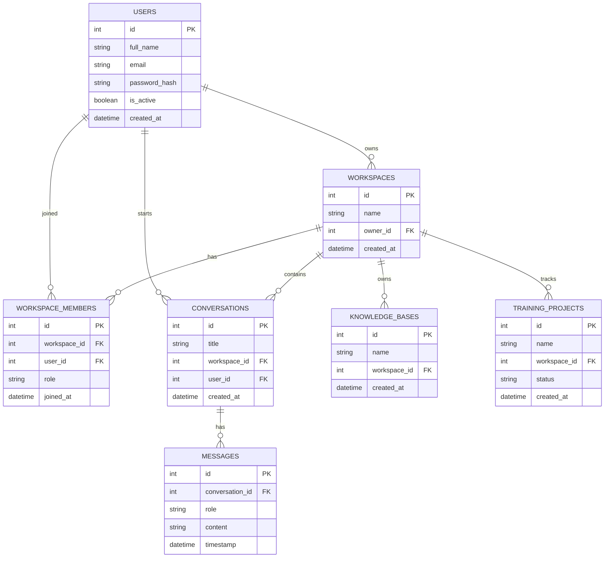

# 🌌 Nexora AI — Version 1.0 Production Platform

<p align="center">
  
</p>

<h3 align="center">Nexora AI — Full-Stack AI Orchestration, RAG, & Machine Learning Workspace</h3>

<p align="center">
  <a href="https://opensource.org/licenses/MIT"></a>
  <a href="https://www.python.org/"></a>
  <a href="https://nodejs.org/"></a>
  <a href="https://nextjs.org/"></a>
</p>

---

Welcome to **Nexora AI v1.0**. This repository contains the complete codebase for a state-of-the-art, enterprise-grade AI execution workspace. Nexora AI provides individual developers and teams with a unified workbench to collaborate, run complex multi-agent simulations, write and execute code in sandboxes, run machine learning training monitors, analyze databases, and build semantic knowledge graphs.

---

## 📐 Platform Architecture & Flow

The entire platform is organized as a multi-tier decoupled system connected via REST APIs and real-time streaming sockets.

```mermaid
sequenceDiagram
    autonumber
    actor User as User Browser (Next.js)
    participant Nginx as Nginx Reverse Proxy
    participant Backend as FastAPI Server
    participant DB as PostgreSQL / SQLite
    participant Qdrant as Qdrant Vector Engine
    participant Sandbox as Python Execution Engine
    participant LLM as External APIs (Gemini/OpenAI)

    User->>Nginx: Request Route (/api/v1/chat)
    Nginx->>Backend: Forward Request
    Backend->>DB: Fetch Active Session & Workspace
    DB-->>Backend: Session Metadata
    Backend->>LLM: Stream Prompt (Planner Agent)
    LLM-->>Backend: Token Stream (Planning Steps)
    rect rgb(30, 41, 59)
        note right of Backend: If SQL / Python task detected
        Backend->>Sandbox: Execute code or query database
        Sandbox-->>Backend: Execution Logs & Result Sets
    end
    Backend->>Qdrant: Query semantic chunks (RAG)
    Qdrant-->>Backend: Matching document context
    Backend->>User: Stream final response tokens + Sources
```



---

## ⚙️ Core Technical Modules (Deep Dive)

### 1. Intelligent Agents & Planner Engine
Nexora AI is powered by a **Hierarchical Planner Agent** pattern. Instead of a basic chat interaction, requests are evaluated by a planner model which delegates execution steps to specific specialized tools and sub-agents:
- **Planner Agent (`agents.py`)**: Parses the input, determines intent, structures a execution plan, and aggregates outputs.
- **Python Agent (`python_agent.py`)**: Generates and executes sandboxed Python code for complex calculations, graphing, or data processing.
- **Email Agent (`email_agent.py`)**: Interacts with mock/real mail gateways to draft, evaluate, and structure communications.
- **Calendar Agent (`calendar_agent.py`)**: Interacts with schedule planners to extract, modify, and reserve events.

### 2. RAG & Semantic Knowledge Hub
The Knowledge module (`knowledge.py`, `rag_debug.py`) manages unstructured data ingestion and search indexing:
- **Document Chunking & Vectorization**: Uploaded files (PDFs, CSVs, TXT) are automatically chunked, embedded using state-of-the-art embedding models, and index-locked inside **Qdrant**.
- **Knowledge Graphs (`knowledge_graph.py`)**: Connects semantic concepts extracted from documents to map relationships visually on the client.
- **RAG Debugger**: Allows developers to view exact vector match scores, chunk text overlaps, and inspect system prompt formulations.

### 3. Machine Learning Studio & Benchmarks
Nexora AI provides built-in tools to manage local and remote machine learning experiments:
- **Dataset Projects (`dataset_projects.py`)**: Manage datasets, clean CSV lines, verify data schemas, and prepare training matrices.
- **Training Monitors (`training_projects.py`)**: Create training runs, track training loss, validation metrics, and download model weights.
- **Evaluations & Quality (`eval.py`, `quality.py`, `benchmark.py`)**: Automate benchmark runs to rate model outputs, test latency, and run prompt performance comparisons.

### 4. Collaboration & Workspaces
All data is scoped inside **Workspaces** to support team operations:
- **Workspaces (`workspaces.py`)**: Supports creating isolated development areas containing custom folders, databases, and LLM preferences.
- **Collaborator Directory (`workspace_members.py`, `workspace_invitations.py`)**: Invite members to workspaces, manage roles, and review pending invites.
- **Template Store (`workspace_templates.py`)**: Quick-start new environments with pre-configured databases, folders, and model presets.

---

## 💾 Database Schema Design

The backend uses SQLAlchemy to interact with the database. The database is designed with the following normalized table relationships:



---

## 🛣️ API Endpoint Specifications

Below is a breakdown of the primary REST API endpoint categories available on the FastAPI backend:

### Authentication & Users
- `POST /api/v1/auth/login`: Validate credentials and issue JWT tokens.
- `POST /api/v1/auth/register`: Create a new user profile.
- `GET /api/v1/users/me`: Fetch current active profile details.

### Workspace Administration
- `GET /api/v1/workspaces`: List all workspaces where the current user is an owner or collaborator.
- `POST /api/v1/workspaces`: Create a new workspace template.
- `POST /api/v1/workspaces/{id}/invite`: Send a workspace invitation link.
- `POST /api/v1/workspaces/import`: Import a packaged workspace archive JSON.

### Chat & Message Feed
- `GET /api/v1/conversations`: Retrieve active chat histories.
- `POST /api/v1/chat/stream`: Stream token responses from the Planner Agent (using Server-Sent Events / SSE).
- `POST /api/v1/messages/{id}/reaction`: Add emoji reactions to chat bubbles.
- `POST /api/v1/conversations/{id}/replay`: Replay step-by-step agent decisions for a past chat.

### Knowledge Base & File Uploads
- `POST /api/v1/knowledge/upload`: Parse and upload files to the vector index.
- `GET /api/v1/knowledge/debug`: Inspect raw vector data chunks.
- `GET /api/v1/search/advanced`: Run composite semantic + keyword queries.

### Machine Learning Console
- `GET /api/v1/training-projects`: Fetch status of active training runs.
- `POST /api/v1/ml/evaluate`: Trigger an automated evaluation run on a model checkpoint.

---

## 🛠️ Complete Local Development Guide

### 1. Backend Service Setup
Navigate to the backend directory and set up a Python virtual environment:
```bash
cd apps/backend

# Create a virtual environment
python -m venv venv

# Activate virtual environment
# On Linux/macOS:
source venv/bin/activate
# On Windows:
venv\Scripts\activate

# Install production and development dependencies
pip install -r requirements.txt

# Run database setup & migrations (creates local dev SQLite database)
python -c "from app.db.database import init_db; init_db()"

# Start the uvicorn API server
uvicorn app.main:app --reload --port 8000
```
The API Swagger documentation will be available at `http://localhost:8000/docs`.

### 2. Frontend Web Interface Setup
Open a new terminal window, navigate to the frontend folder, and install the Node packages:
```bash
cd apps/frontend

# Install dependencies
npm install

# Run Next.js hot-reloaded development server
npm run dev
```
Open `http://localhost:3000` in your web browser.

---

## 🐳 Docker Staging Deployment

For production-simulated environments, we use Docker Compose to run the entire service mesh.

1. **Configure API Secrets**:
   Copy `.env.production.example` to `.env.production` at the root of the project:
   ```bash
   cp .env.production.example .env.production
   ```
   Open the file and configure your LLM provider secret tokens:
   - `GEMINI_API_KEY`: Google Gemini API key.
   - `OPENAI_API_KEY`: OpenAI API token.

2. **Start the Container Stack**:
   Use the Makefile commands to build images and launch containers:
   ```bash
   make up
   ```
   This orchestrates:
   - **Nginx Proxy**: Enforces routing (`/api` routes to FastAPI, other routes to Next.js).
   - **FastAPI backend (App)**: Web server.
   - **Next.js frontend (App)**: Static SSR server.
   - **PostgreSQL**: Production relational database storage.
   - **Qdrant**: High-performance vector database.
   - **Redis**: Fast cache storage for agent states and rate limits.

3. **Verify Health & Logs**:
   ```bash
   make status
   make logs
   ```
