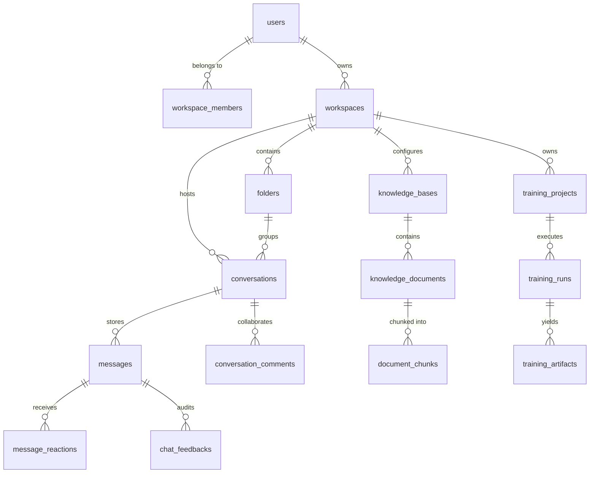
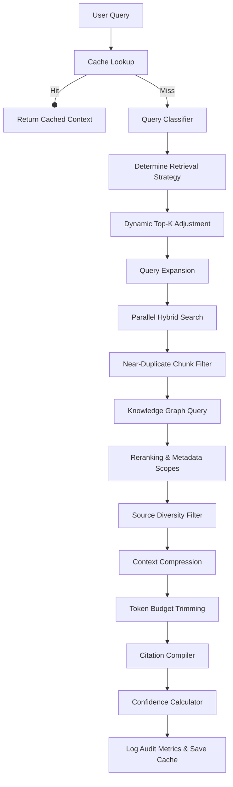

# Nexora AI - Complete Technical Architecture & System Design Documentation

**Version:** 1.0.0  
**Status:** Approved | Release Ready  
**Authors:** Vishvam Prajapati & AI Co-Pilot  
**Project Type:** Enterprise AI & RAG Platform  
**Target Architecture:** Multi-Agent, Fine-Tuning, Hybrid Search, and Workspace-Scoped Collaboration  
**Last Updated:** July 2026  

---

## Table of Contents
1. [Executive Summary & Project Vision](#1-executive-summary--project-vision)
2. [Global Architecture & Repository Layout](#2-global-architecture--repository-layout)
3. [Database Architecture & Entity-Relationship Schema](#3-database-architecture--entity-relationship-schema)
4. [FastAPI Web Backend & API Endpoints](#4-fastapi-web-backend--api-endpoints)
5. [AI Provider Framework & Multi-LLM Interfacing](#5-ai-provider-framework--multi-llm-interfacing)
6. [Adaptive RAG (Retrieval-Augmented Generation) Pipeline](#6-adaptive-rag-retrieval-augmented-generation-pipeline)
7. [Dataset Factory: Synthetic Data Generation Suite](#7-dataset-factory-synthetic-data-generation-suite)
8. [Fine-Tuning Integration: PEFT, QLoRA & Unsloth Engine](#8-fine-tuning-integration-peft-qlora--unsloth-engine)
9. [Workspace Governance, Collaboration & Enterprise Import/Export](#9-workspace-governance-collaboration--enterprise-importexport)
10. [Local Development, Docker Orchestration & Environment Setup](#10-local-development-docker-orchestration--environment-setup)

---

## 1. Executive Summary & Project Vision

### 1.1 Overview
Nexora AI is an enterprise-grade, full-stack AI development platform designed to bridge the gap between model fine-tuning, retrieval-augmented generation (RAG), and collaborative workspace management. It unifies operations that typically require fragmented systems (such as Jupyter notebooks, Power BI, custom RAG vector-stores, and model training pipelines) into a single, cohesive developer-first application.

### 1.2 Core Mission
To democratize enterprise AI by making advanced analytics, machine learning, and generative AI accessible through a single, easy-to-use platform that organizations can deploy locally or in cloud-native environments. 

### 1.3 Core Engineering Philosophy
1. **Explainable AI:** Every response generated should have clear source attribution, showing where the data came from and what queries retrieval nodes executed.
2. **Local-First & Privacy-Focused:** All data processing, vector indexing, and model fine-tuning can happen on local GPU hardware.
3. **Modular and Extensible:** Independent packages for dataset generation (`dataset_factory`) and application APIs (`apps/backend`) are decoupled to allow scaling.
4. **Role-Based Governance:** Enterprise-ready workspace isolation with strict RBAC (Owner, Admin, Editor, Viewer).

---

## 2. Global Architecture & Repository Layout

The repository is structured to cleanly separate the runtime services from synthetic dataset generation facilities. Below is the comprehensive file tree.

```text
Nexora-AI/
├── .github/                  # CI/CD Workflows and pull request templates
├── apps/                     # Application Submodules
│   ├── backend/              # Core API Server (FastAPI, SQLAlchemy, Alembic)
│   │   ├── alembic/          # Database Migration scripts
│   │   ├── alembic.ini       # Migration Configuration
│   │   ├── app/              # FastAPI Application Source
│   │   │   ├── api/          # Route controllers (v1 endpoints)
│   │   │   ├── db/           # Connection engine, Base model, Session generators
│   │   │   ├── models/       # 23 Database Entity definitions (SQLAlchemy)
│   │   │   ├── prompts/      # Base System & Developer text prompts
│   │   │   ├── providers/    # Interface & wrappers (OpenAI, Gemini, Ollama, etc.)
│   │   │   ├── repositories/ # Database query abstraction classes
│   │   │   ├── schemas/      # Request/Response validation schemas (Pydantic)
│   │   │   ├── security/     # Password hashing, JWT dependencies
│   │   │   ├── services/     # RAG, fine-tuning, search, and workspace services
│   │   │   └── utils/        # Generic math and similarity helpers
│   │   ├── main.py           # API startup and FastAPI entrypoint
│   │   ├── config.py         # Application BaseSettings configuration
│   │   ├── requirements.txt  # Python packages list for the backend service
│   │   └── .env.example      # Sample configurations for backend
│   └── frontend/             # Single-Page Web Dashboard (Stub placeholder)
├── dataset_factory/          # Synthetic Data Generation Suite
│   ├── generators/           # Domain-specific conversational generators
│   │   ├── base_generator.py # Abstract base class with template render utilities
│   │   ├── coding_gen.py     # Generates 10k coding prompts & splits
│   │   ├── business_gen.py   # Generates corporate & strategic analytics data
│   │   ├── reasoning_gen.py  # Math and logical step-by-step reasoning splits
│   │   ├── personality_gen.py# Custom persona and character dataset splits
│   │   ├── identity_gen.py   # System description and model identification datasets
│   │   ├── conversation_gen.py # Chat & standard QA dataset splits
│   │   └── system_prompts_gen.py # Diverse instruction formatting splits
│   ├── validator.py          # Enforcer of JSONLines schemas, hashes & content
│   └── cli.py                # CLI runner executing generation & validation
├── datasets/                 # Local directory containing compiled .jsonl datasets
├── docker/                   # Docker deployment configurations
├── docs/                     # Technical specifications, PRDs, and Sprint plans
├── models/                   # Local workspace for downloaded LLM adapter weights
├── notebooks/                # Jupyter Notebooks for exploratory data analysis
├── scripts/                  # Command-line utility scripts for maintenance
├── tests/                    # Automated testing suite
├── run_factory.py            # Entry script to invoke the dataset CLI
├── convert_reqs.py           # Requirements UTF-8 and package conversion script
├── docker-compose.yml        # Multi-container local execution setup
├── requirements.txt          # Python package requirements for workspace root
└── README.md                 # Project quick-start and features guide
```

---

## 3. Database Architecture & Entity-Relationship Schema

Nexora AI relies on a relational SQL structure (PostgreSQL in production, SQLite for local unit-testing) powered by SQLAlchemy. Below is the detailed layout of the 23 database entities.

### 3.1 Core Database Tables

| Table Name | Model Name | Primary Key | Critical Foreign Keys | Purpose |
| :--- | :--- | :--- | :--- | :--- |
| `users` | `User` | `id` | None | Stores user profile, email, hashed passwords, and workspace mappings. |
| `workspaces` | `Workspace` | `id` | `owner_id` -> `users.id` | Represents logical tenant isolation. Controls export permission settings. |
| `workspace_members`| `WorkspaceMember`| `id` | `workspace_id`, `user_id`| Maps users to workspaces with role constraints (Owner, Admin, Editor, Viewer). |
| `workspace_invitations` | `WorkspaceInvitation` | `id` | `workspace_id`, `sender_id` | Manages registration invites for new users. |
| `folders` | `Folder` | `id` | `workspace_id` -> `workspaces.id` | Grouping container for organizing user conversations. |
| `conversations` | `Conversation` | `id` | `workspace_id`, `user_id`, `folder_id` | Stores chat metadata, summarization memory, and pinned status. |
| `messages` | `Message` | `id` | `conversation_id` -> `conversations.id` | Stores turn-by-turn chat prompts (role: user, assistant, system). |
| `conversation_comments` | `ConversationComment` | `id` | `conversation_id`, `user_id`, `parent_comment_id` | Supports collaborative thread reviews under chats. |
| `message_reactions` | `MessageReaction` | `id` | `message_id` -> `messages.id`, `user_id` | User emoji tracking on AI/User messages. |
| `favorites` | `Favorite` | `id` | `user_id`, `conversation_id` | Bookmarks specific chat sessions for users. |
| `conversation_versions` | `ConversationVersion` | `id` | `conversation_id` -> `conversations.id` | Revision history snapshots for restoring past messages. |
| `knowledge_bases` | `KnowledgeBase` | `id` | `workspace_id` -> `workspaces.id` | Top-level configurations of data index repositories. |
| `knowledge_documents` | `KnowledgeDocument` | `id` | `knowledge_base_id` -> `knowledge_bases.id` | Stores imported file details (PDF, CSV, MD). |
| `document_chunks` | `DocumentChunk` | `id` | `document_id` -> `knowledge_documents.id` | Extracted text fragments with pagination offsets and token count. |
| `knowledge_nodes` | `KnowledgeNode` | `id` | `workspace_id` -> `workspaces.id` | Semantic concepts used in Knowledge Graph traversal. |
| `knowledge_edges` | `KnowledgeEdge` | `id` | `workspace_id`, `source_node_id`, `target_node_id` | Relationship links forming semantic graph connections. |
| `retrieval_logs` | `RetrievalLog` | `id` | `workspace_id` -> `workspaces.id` | Logs RAG latency, confidence scores, and chunk filtration details. |
| `chat_feedbacks` | `ChatFeedback` | `id` | `conversation_id`, `message_id`, `user_id` | Captures audit metadata (thumbs up/down ratings, logs). |
| `dataset_projects` | `DatasetProject` | `id` | `workspace_id` -> `workspaces.id` | Workspace container tracking clean dataset compilation projects. |
| `dataset_versions` | `DatasetVersion` | `id` | `project_id` -> `dataset_projects.id` | Version history of exported synthetic sets. |
| `training_projects`| `TrainingProject`| `id` | `workspace_id` -> `workspaces.id` | Model fine-tuning projects workspace container. |
| `training_runs` | `TrainingRun` | `id` | `project_id` -> `training_projects.id` | Individual fine-tuning execution details (loss, VRAM, hyperparameters). |
| `training_artifacts`| `TrainingArtifact`| `id` | `run_id` -> `training_runs.id` | Storage directory locations of trained PEFT adapters. |

### 3.2 Entity-Relationship Flow
The diagram below illustrates how core database objects relate.



---

## 4. FastAPI Web Backend & API Endpoints

### 4.1 FastAPI Configuration
The backend application in [main.py](file:///d:/Nexora-AI/apps/backend/app/main.py) uses a standard Python ASGI server (Uvicorn). Settings are managed via Pydantic settings from environment files.

```python
app = FastAPI(
    title=settings.APP_NAME,
    version=settings.APP_VERSION,
    description="The core API service powering the Nexora AI platform.",
)
app.include_router(api_router)
```

### 4.2 Endpoint Router Map
The endpoints are modularly registered under `/api/v1` in [router.py](file:///d:/Nexora-AI/apps/backend/app/api/v1/router.py). Key sub-modules include:

* **Authentication & User Management:** `/auth`, `/users` handles passwords (using bcrypt via passlib) and issues signed JWT tokens (using python-jose).
* **Workspace Lifecycle:** `/workspaces` controls space creation, invites, exports, and templates. Includes route handlers like `workspace_invitations.py` and `workspace_members.py`.
* **Conversations & Messages:** `/conversations` supports pinning, archiving, soft-deleting, hard-deleting, and version reversion. `/messages` handles post submission.
* **Core AI Chat:** `/chat` integrates database logging with LLM calls, streaming chunks back via Server-Sent Events (SSE).
* **Knowledge & RAG Management:** `/knowledge` and `/advanced-search` handles PDF parsing, vector ingestion, and debugging.
* **Benchmarking & Fine-Tuning Monitoring:** `/training-projects` and `/dataset-projects` tracks training loss curves and custom synthetic sets.

---

## 5. AI Provider Framework & Multi-LLM Interfacing

### 5.1 Provider Architecture Pattern
Nexora AI decouples model interactions via an abstract base class: [AIProviderInterface](file:///d:/Nexora-AI/apps/backend/app/providers/provider_interface.py). It defines two key methods:
1. `generate_response(messages)` -> Returns the complete completion string.
2. `generate_stream_response(messages)` -> Yields token parts incrementally.

### 5.2 Supported Providers
* **OpenAI Provider:** Calls GPT family models via the standard OpenAI SDK, with support for custom endpoints (like LocalAI or vLLM hosts) using `OPENAI_API_BASE`.
* **Gemini Provider:** Connects directly to Google's Gemini models using the native API.
* **Ollama Provider:** Integrates local LLM execution on the developer's workstation by interfacing with local Ollama daemons.
* **OpenRouter Provider:** Aggregates multi-model routing across external server infrastructures.

### 5.3 Dynamic Factory Instantiation
The system determines which wrapper class to use at runtime based on the `settings.AI_PROVIDER` parameter using the factory class [ProviderFactory](file:///d:/Nexora-AI/apps/backend/app/providers/provider_factory.py):

```python
class ProviderFactory:
    _registry = {
        "openai": OpenAIProvider,
        "openrouter": OpenRouterProvider,
        "gemini": GeminiProvider,
        "ollama": OllamaProvider
    }
```

---

## 6. Adaptive RAG (Retrieval-Augmented Generation) Pipeline

Nexora AI implements an advanced, workspace-scoped RAG flow to maximize contextual accuracy while minimizing token overhead. The pipeline consists of 16 key execution steps orchestrated by [AdaptiveRetrievalService](file:///d:/Nexora-AI/apps/backend/app/services/adaptive_retrieval_service.py).



### 6.1 Core Pipeline In-Depth

1. **Cache Lookup:** Checks if the identical prompt is present in `RetrievalCache` for the active workspace. If found and not expired, returns the cached context.
2. **Query Classification:** [QueryClassifier](file:///d:/Nexora-AI/apps/backend/app/services/query_classifier.py) maps queries into semantic categories (e.g. `Greeting`, `Debugging`, `Coding`, `Summarization`, `Knowledge Search`).
3. **Context Strategy Routing:** [ContextStrategyEngine](file:///d:/Nexora-AI/apps/backend/app/services/context_strategy.py) maps the category to a retrieval strategy. For example, `Greetings` skip retrieval (`No Retrieval`), while `Debugging` routes to `Hybrid Retrieval`.
4. **Dynamic Top-K Adjustment:** Resizes the target chunk count. `Summarization` requests retrieve 2 chunks, while `Coding` or `Debugging` request larger budgets (e.g. 12 chunks) to ensure sufficient context.
5. **Query Expansion:** Expands search terms using synonyms and intent classification to handle vocabulary mismatches.
6. **Parallel Hybrid Search:** Interlaces semantic vector search and lexical keyword search in parallel. Results are normalized, weighted (`settings.HYBRID_VECTOR_WEIGHT` vs `settings.HYBRID_KEYWORD_WEIGHT`), and merged.
7. **Near-Duplicate Chunk Filtration:** Computes a Jaccard similarity coefficient between chunk texts. Chunks with higher than 90% overlap are filtered out to save token space.
8. **Knowledge Graph Traversal:** Extracts related concepts from `knowledge_edges` and `knowledge_nodes` to add structured relationships to the search context.
9. **Reranking:** Re-orders raw search hits using document metadata, recency, and similarity scores.
10. **Source Diversity Filter:** Restricts any single document from occupying more than 2 chunk slots, ensuring the model gets context from diverse document origins.
11. **Context Compression:** Trims sentences and removes low-information strings to compress context size.
12. **Token Budget Trimming:** Hard-limits final token length to the configured budget (e.g., 4000 tokens) using token counting algorithms.
13. **Citation Compiler:** Embeds metadata footnotes (document name, page number, section headings) so the user can verify response accuracy.
14. **Confidence Calculator:** Evaluates retrieval quality based on vector similarity and query alignment.
15. **Audit Logging:** Saves performance metrics (retrieval latency, chunk acceptance counts) in `RetrievalLog`.
16. **Cache Save:** Caches final context structure for future lookups.

---

## 7. Dataset Factory: Synthetic Data Generation Suite

To build custom models, Nexora AI includes a synthetic data generator package (`dataset_factory`). It uses prompt variations to generate large, structured dataset sets of system instructions.

### 7.1 Generator Structure
Each subclass inherits from [BaseGenerator](file:///d:/Nexora-AI/dataset_factory/generators/base_generator.py), which provides template rendering and duplicate hashing functions:

* **Identity Generator:** Generates dataset sets specifying the assistant's name ("Nexora AI") and ownership metadata, preventing model hallucination.
* **Personality Generator:** Synthesizes custom conversational responses using professional, educational, or developer-focused tones.
* **Coding Generator:** The largest generator, compiling 10k+ multi-turn dialogues across 14 programming languages and technical categories.
* **Reasoning Generator:** Creates step-by-step logic, math, and database normalization flows.
* **Business Generator:** Focuses on business questions, including corporate strategies and KPI tracking.
* **System Prompts Generator:** Formats inputs using different instruction layouts.

### 7.2 Validation & Quality Control
The validator [validator.py](file:///d:/Nexora-AI/dataset_factory/validator.py) checks all files in the output directory for:
* **UTF-8 Compliance:** Ensures no broken bytes.
* **Schema Integrity:** Verifies that every line parses into a valid JSON object matching the format: `{"messages": [{"role": "system"/"user"/"assistant", "content": "..."}]}`.
* **Data Uniqueness:** Detects and flags duplicate conversations by checking the hashes of the initial user prompt.

---

## 8. Fine-Tuning Integration: PEFT, QLoRA & Unsloth Engine

Nexora AI supports local model fine-tuning through Parameter-Efficient Fine-Tuning (PEFT) and Quantized Low-Rank Adaptation (QLoRA) using Unsloth.

### 8.1 Fine-Tuning Execution flow
* **GPU Resource Ingestion:** [GPUDetectionService](file:///d:/Nexora-AI/apps/backend/app/services/gpu_detection_service.py) scans CUDA compute capabilities, total VRAM size, and BF16 availability. It dynamically recommends hyperparameters (e.g., batch sizes and rank values).
* **Unsloth Integration:** [UnslothIntegrationService](file:///d:/Nexora-AI/apps/backend/app/services/unsloth_integration_service.py) configures the base model (e.g., Qwen 2.5 or Llama 3) in 4-bit, sets up target layers (`q_proj`, `v_proj`, etc.), and runs `SFTTrainer`.
* **Execution Logs:** The database tracks progress steps, current loss, learning rate decay, and VRAM utilization, which are recorded in `TrainingLog`.
* **Local Simulation Fallback:** If PyTorch or Unsloth is missing (e.g., in a CPU development environment), the service falls back to a simulated execution to verify database updates and output artifact generation.

---

## 9. Workspace Governance, Collaboration & Enterprise Import/Export

The platform provides workspace isolation with granular permissions and data portability features.

### 9.1 Role-Based Access Control (RBAC)
The [PermissionService](file:///d:/Nexora-AI/apps/backend/app/services/permission_service.py) enforces security policies across four roles:

1. **Owner:** Full administrative access, including deleting workspaces and transferring ownership.
2. **Admin:** Access to all operations, excluding ownership transfer.
3. **Editor:** Can read workspace assets, create folders, and manage conversations. Editors can only modify or delete conversations they created.
4. **Viewer:** Read-only access to workspaces, folders, conversations, and search endpoints.

### 9.2 Enterprise Export Engine
The [WorkspaceExportService](file:///d:/Nexora-AI/apps/backend/app/services/workspace_export_service.py) aggregates database records (conversations, messages, reactions, comments) and packages them into four formats:
* **Raw JSON Metadata:** Complete database export, useful for migration or backups.
* **Markdown Script:** Human-readable compilation of all chats and comments.
* **HTML Interface:** Fully styled, responsive offline chat dashboard.
* **ZIP Archive:** Combines folders and markdown chats into a single zip file.

### 9.3 Enterprise Import Engine
The [WorkspaceImportService](file:///d:/Nexora-AI/apps/backend/app/services/workspace_import_service.py) handles importing datasets from three external sources:
* **Zip Backups:** Re-creates the original folder structures and files.
* **Markdown Files:** Parses markdown chats using prefix regex patterns (e.g. `### Chat:`, `**USER:**`).
* **ChatGPT/Claude Exports:** Maps ChatGPT JSON exports into standard Nexora database records.

---

## 10. Local Development, Docker Orchestration & Environment Setup

### 10.1 System Prerequisites
* **Python:** Version 3.10 or higher.
* **NodeJS:** Version 18.0.0 or higher.
* **Docker:** Engine version 20+ with Docker Compose support.

### 10.2 Installation Steps

1. **Environment Setup:** Configure settings by copying the template environment file:
   ```bash
   cp apps/backend/.env.example apps/backend/.env
   ```

2. **Database Migrations:** Run migrations using Alembic:
   ```bash
   cd apps/backend
   alembic upgrade head
   ```

3. **Start the API Server:** Run the FastAPI application locally:
   ```bash
   uvicorn app.main:app --reload --port 8000
   ```

4. **Run the Dataset Factory:** Generate synthetic datasets using the CLI:
   ```bash
   # Generate all datasets
   python run_factory.py --generate
   
   # Validate generated JSONL datasets
   python run_factory.py --validate
   ```

5. **Docker Compose Deployment:** Deploy using the pre-configured compose setup:
   ```bash
   docker-compose up --build
   ```

### 10.3 Configuration Settings
Configurable variables in the environment file include:
* `DATABASE_URL`: PostgreSQL connection string.
* `AI_PROVIDER`: Selected provider (`openai`, `gemini`, `ollama`, or `openrouter`).
* `OPENAI_API_KEY`: API key for OpenAI.
* `RAG_TOP_K`: Max chunks to retrieve.
* `ENABLE_RERANKING`: Toggles secondary context ranking.
